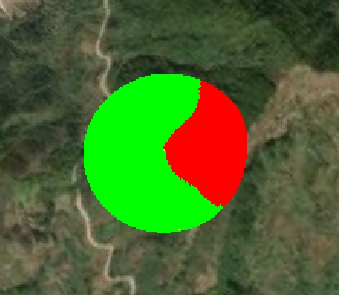
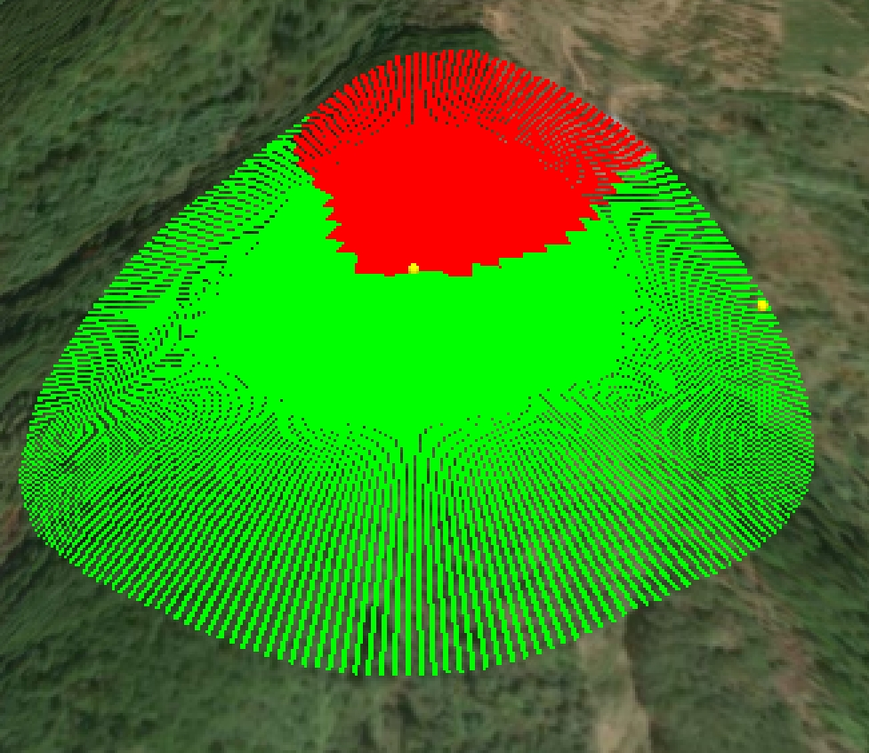

# Cesium实现可视化分析

## 一、地形可视域主要实现技术（Ray + 地形碰撞检测）

Cesium 本身的 Ray 类可以用来执行非常精确的射线检测，我们可以结合地形高度（sample）来逐点检测光线是否与 terrain 相交，从而判断是否可见。

## 1.1 优势

* 实时判断每条射线是否被 terrain 遮挡
* 地形自适应，无需手动插值点
* 可用于单点/多点、动态或静态场景

## 1.3 实现思路

* 1、从观察点生成一条 Ray（方向 = 目标点 - 观察点）；
* 2、在这条 Ray 上按一定间隔采样点；
* 3、对这些点采样地形高度；
* 4、比较：如果地形高 > Ray 上该点高，说明被遮挡

## 1.3 核心代码如下

根据起点和终点生成一条射线Rag

```js
  const start = startCartesian;
  const end = endCartesian;
  const direction = Cesium.Cartesian3.subtract(end, start, new Cesium.Cartesian3());
  Cesium.Cartesian3.normalize(direction, direction); // 归一化方向向量
  const ray = new Cesium.Ray(start, direction);
```

在这条 Ray 上按一定间隔采样点

```js
    const distance = Cesium.Cartesian3.distance(start, end);
    const steps = Math.ceil(distance / 10);
    const positions = [];
  
    for (let i = 0; i <= steps; i++) {
      const point = Cesium.Ray.getPoint(ray, (i / steps) * distance);
      const carto = Cesium.Cartographic.fromCartesian(point);
      positions.push(carto);
    };
```

对这些点采样地形高度

```js
 Cesium.sampleTerrainMostDetailed(that.viewer.terrainProvider, positions).then((samples) => {})
```

比较：如果地形高 > Ray 上该点高，说明被遮挡

```js
    let rayPoint = Cesium.Ray.getPoint(ray, (i / steps) * distance);
    const carto = Cesium.Cartographic.fromCartesian(rayPoint);
    let visualFlag = false;
    if (carto.height >  samples[i].height) {
        visualFlag = true; // 被遮挡
    };
```

## 1.4 最终效果如下




## 二、城市建筑物模型实现可视域（如3Dtile）

**以下就不贴代码，网上类似的很多，主要写实现步骤**

**实现步骤如下：**

### 2.1、设置观测点；

可以手动交互式的，也可以自己设定

### 2.2、创建虚拟点光源

> 这个方法创建一个虚拟相机作为光源，位于观测点位置，朝向观测方向，并设置视锥体参数（近平面、远平面、视场角、纵横比等）。这个相机将用于生成深度图。

### 2.3、创建阴影贴图

> 这个方法创建了一个ShadowMap对象，用于从光源（观测点）角度生成场景的深度信息。设置isPointLight为true表示从点光源出发，可以向各个方向投射视线。

### 2.4、创建后处理

> 后处理是可视域分析中最关键的部分，注意：着色器需要根据Cesium版本进行语法变更，webgl1跟webgl2的语法略有不同。 通过自定义着色器来渲染可视域分析的结果；
> 这个方法创建了一个后处理，其中包含自定义的片元着色器。着色器通过比较每个像素点到观测点的距离与深度图中记录的距离，判断该点是否在视线范围内，然后对可见区域和不可见区域分别着色。

### 2.5、色器代码的工作流程是

 1、获取当前像素的颜色和深度信息
 2、转换到相机坐标系和世界坐标系
 3、转换到观测点（虚拟相机）坐标系
 4、判断点是否在观测距离范围内
 5、判断点是否在视锥体内
 6、通过shadow函数判断点是否可见
 7、根据可见性结果进行着色